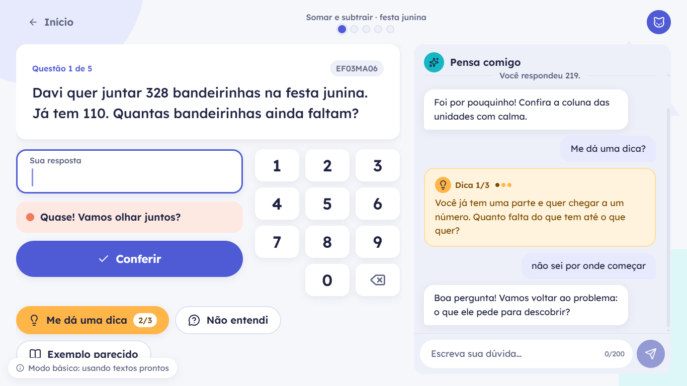
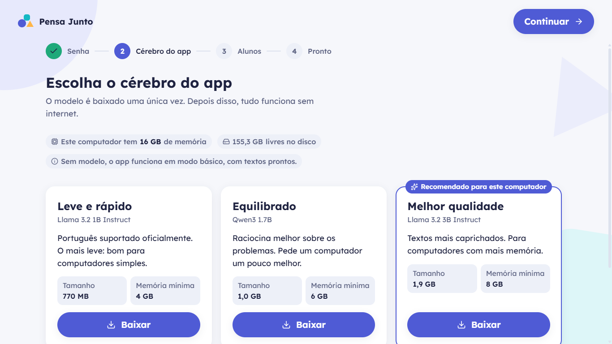
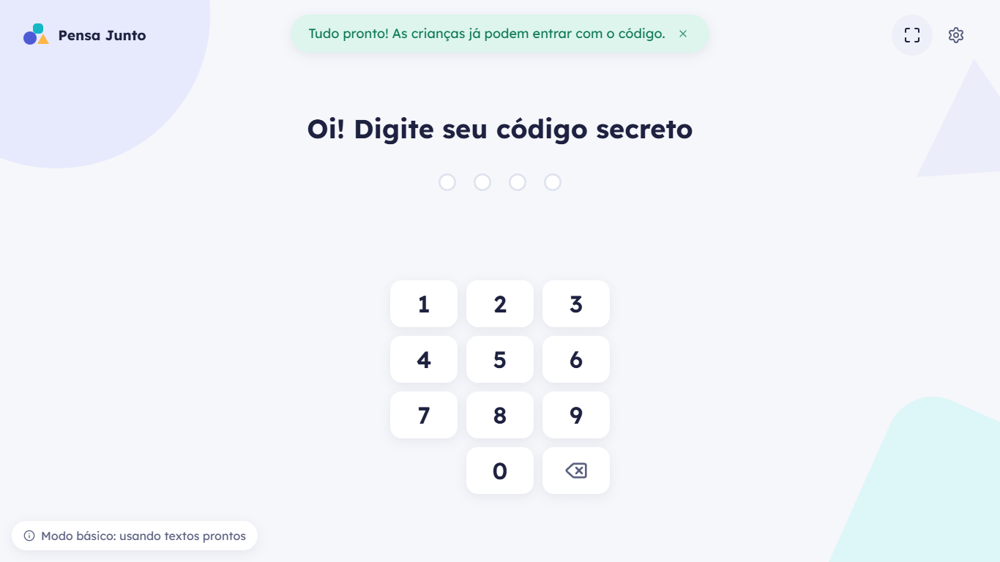
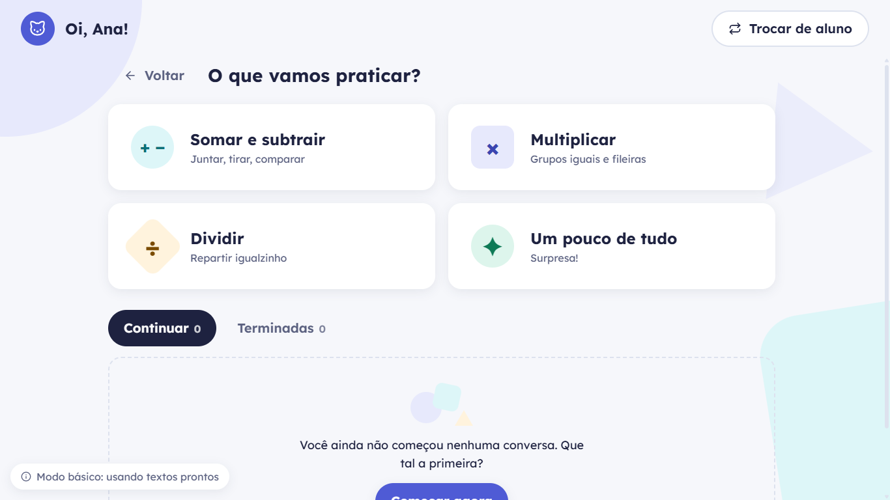
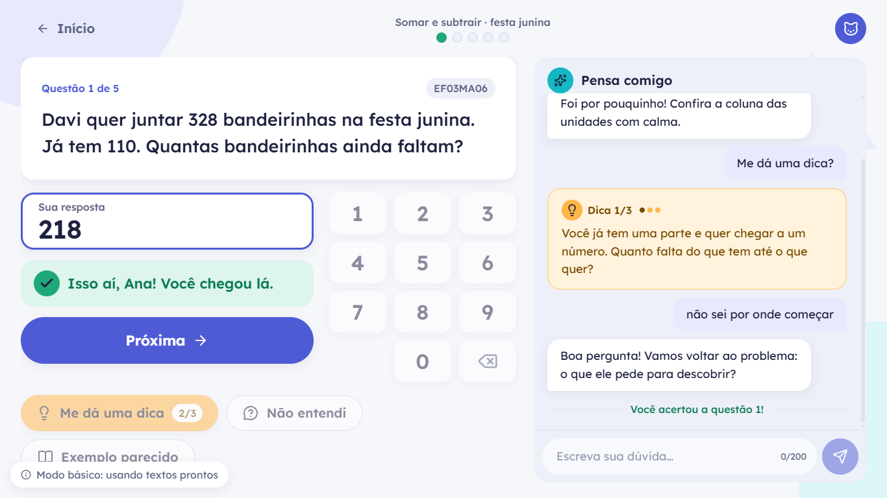
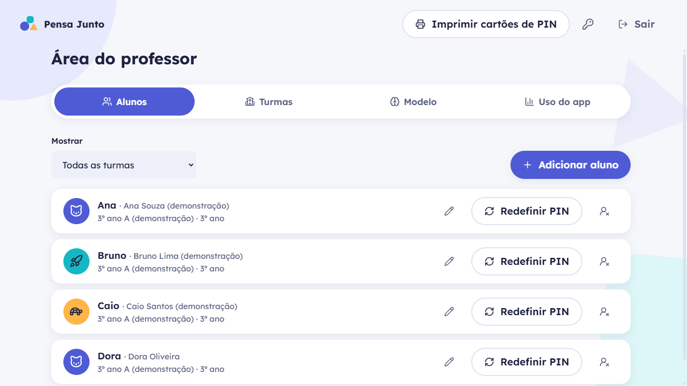
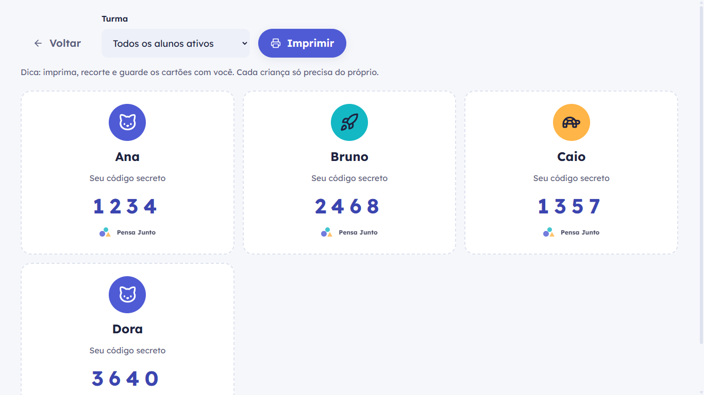
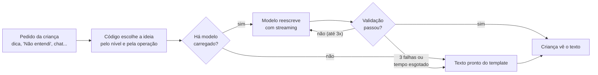
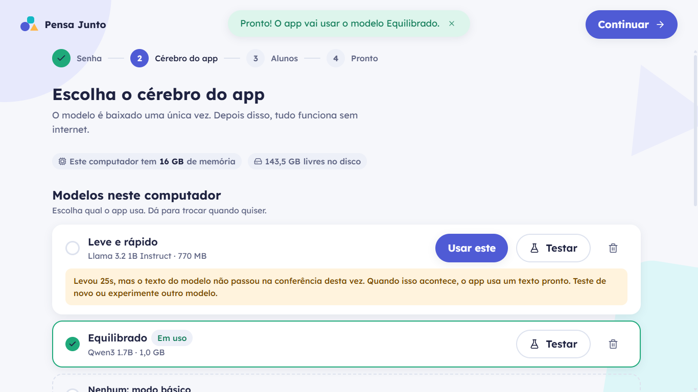

<div align="center">


# Pensa Junto

**Tutor de matemática 100% offline para o 3º ano, com um modelo de linguagem rodando no próprio computador da escola.**

Versão **1.1.0** · Windows (Electron) · BNCC 3º ano, unidade Números · Português do Brasil

</div>



> "Pensa Junto" é um nome provisório.

---

## Sumário

- [Por que existe](#por-que-existe)
- [O que a versão 1 faz](#o-que-a-versão-1-faz)
- [Telas](#telas)
- [Como funciona](#como-funciona)
- [Pedagogia: BNCC e ajuda socrática](#pedagogia-bncc-e-ajuda-socrática)
- [A validação que protege a criança](#a-validação-que-protege-a-criança)
- [Modelos de linguagem](#modelos-de-linguagem)
- [Arquitetura](#arquitetura)
- [Como rodar](#como-rodar)
- [Testes e qualidade](#testes-e-qualidade)
- [Benchmark e simulação de PC de escola](#benchmark-e-simulação-de-pc-de-escola)
- [Instalador e distribuição](#instalador-e-distribuição)
- [Sincronização com a nuvem (opcional)](#sincronização-com-a-nuvem-opcional)
- [Design e acessibilidade](#design-e-acessibilidade)
- [Decisões e desvios da especificação](#decisões-e-desvios-da-especificação)
- [Limitações conhecidas e próximos passos](#limitações-conhecidas-e-próximos-passos)
- [Changelog](#changelog)

---

## Por que existe

Professores de escolas públicas de periferia têm pouco tempo e pouca infraestrutura, muitas vezes sem internet. O Pensa Junto roda num computador da escola ou no notebook do professor e dá a cada criança um tutor paciente de matemática, **sem depender de internet e sem entregar a resposta**.

A criança:

1. entra com um **código secreto de 4 números** (PIN);
2. resolve **questões geradas pelo app, alinhadas à BNCC**;
3. quando trava, pede ajuda: **dicas em 3 níveis**, **"Não entendi"**, **"Exemplo parecido"** ou uma conversa curta. A ajuda segue o método socrático: perguntas que levam a criança a chegar sozinha ao resultado.

**O app nunca mostra a resposta da questão.** Não existe botão de "desistir e ver a resposta". Depois da dica 3/3 e de 3 tentativas, a criança pode **chamar o professor** ou **tentar outra questão**.

---

## O que a versão 1 faz

### Para a criança

- **Login por PIN** com teclado numérico grande (e teclado físico). Valida sozinho ao completar os 4 dígitos; depois de 5 erros seguidos, espera de 30 s com contagem visível.
- **Início** com "Nova conversa" e 4 focos: *Somar e subtrair*, *Multiplicar*, *Dividir* e *Um pouco de tudo*.
- **Sessões de 5 questões** com progresso visível, retomáveis pela lista "Continuar". As concluídas ficam em "Terminadas", só para leitura.
- **Tela da sessão** em duas colunas: questão, resposta e teclado de um lado; conversa com o tutor ("Pensa comigo") do outro.
- **Feedback gentil:** acerto com animação e "Isso aí, Ana! Você chegou lá."; erro em coral suave com "Quase! Vamos olhar juntos?", seguido de uma pergunta do tutor baseada na tentativa.
- **Tudo é salvo a cada interação.** Fechar o app no meio e voltar restaura a mesma questão, as tentativas e a conversa.

### Para o professor

- **Primeira execução guiada:** boas-vindas → senha do professor → escolha do modelo → cadastro de alunos.
- **Área do professor** (engrenagem na tela de PIN ou `Ctrl+Shift+P`, protegida por senha):
  - turmas e alunos: criar, editar, desativar e reativar;
  - **PIN gerado automaticamente**, único entre alunos ativos e sem sequências óbvias (0000, 1234…), mostrado uma vez, com "Gerar outro" e "Redefinir PIN";
  - **impressão de cartões de PIN** (nome, avatar e código);
  - troca do modelo, importação por pendrive e **métricas de uso** (tempo médio e quanto o texto pronto substituiu o modelo).

### Por baixo

- **Funciona sem internet.** A rede só é usada para baixar o modelo (uma vez) e na sincronização opcional.
- **Modo básico:** sem modelo, ou num computador fraco demais, o app continua funcionando com os textos prontos dos templates.
- **Pré-geração:** a próxima questão é preparada em segundo plano enquanto a criança resolve a atual.

---

## Telas

| | |
|:---:|:---:|
|  **Primeira execução** |  **"Escolha o cérebro do app"** |
|  **Código secreto** |  **O que vamos praticar?** |
|  **Acerto com o nome da criança** |  **Conversa concluída** |
|  **Área do professor** |  **Cartões de PIN para imprimir** |

*Capturas geradas pelo teste de ponta a ponta (`tests/e2e/happy-path.spec.ts`), em modo básico e na resolução-alvo de 1366×768.*

---

## Como funciona

### O princípio

| Quem | Faz o quê |
|---|---|
| **Código** (`src/core`) | Escolhe a habilidade e o template, sorteia os números (com *seed*), calcula a resposta e os passos, corrige e escolhe a **ideia pedagógica** de cada ajuda. |
| **Modelo de linguagem** (`node-llama-cpp`) | Só linguagem: **reescreve** o enunciado e as ajudas de um jeito mais vivo e conversa com a criança. |
| **Validação** (`src/core/validation.ts`) | Confere **toda** saída do modelo antes de chegar à criança. Até 3 tentativas; se nenhuma passa, usa o texto pronto do template. |

O modelo **nunca** corrige a resposta e **nunca** é a fonte da resposta correta. A resposta correta **nunca vai para a tela**: a conferência acontece no processo principal (main), via IPC.

### O caminho de um texto do tutor



### Streaming seguro

O texto aparece enquanto o modelo escreve, mas o processo principal **só libera o que já passou pela validação**. Ele também **segura números incompletos**: "duzentos e…" só aparece quando dá para saber se vira "duzentos e vinte e dois", que poderia ser a resposta. Se a validação falhar no meio, a tela recebe um `reset` e o texto some antes de qualquer coisa proibida aparecer.

### Questões reproduzíveis

Cada questão guarda `template_id`, `seed` e tema. A mesma combinação reconstrói **exatamente** a mesma questão (números, resposta e passos), e é assim que uma sessão é retomada depois de fechar o app.

---

## Pedagogia: BNCC e ajuda socrática

### Habilidades do MVP (3º ano, unidade Números)

| Código | Resumo *(paráfrase; conferir o texto oficial)* | Templates na v1 |
|---|---|---|
| EF03MA03 | Fatos básicos da adição e da multiplicação | `fatos.adicao`, `fatos.multiplicacao` (contas diretas curtas) |
| EF03MA05 | Cálculo mental e escrito: adição e subtração | `calculo.adicao`, `calculo.subtracao` (até 999) |
| EF03MA06 | Significados da adição e da subtração | `juntar`, `acrescentar`, `separar`, `retirar`, `comparar`, `completar` |
| EF03MA07 | Multiplicação por 2, 3, 4, 5 e 10 | `parcelas-iguais`, `retangular` (fileiras) |
| EF03MA08 | Divisão por números até 10 | `repartir`, `medida` (resto zero) · `repartir-resto` como extensão |

São **15 templates** e **10 temas** (escola, feira, futebol, animais, cozinha, parque, biblioteca, festa junina, horta e brinquedos). Os textos da BNCC estão marcados com `// TODO: conferir texto oficial da BNCC`.

### Tipos de ajuda

| Ajuda | O que acontece |
|---|---|
| 💡 **Dica 1/3 → 2/3 → 3/3** | Nível 1: uma pergunta que faz pensar. Nível 2: aponta o próximo passo. Nível 3: guia uma parte da conta ou usa números menores. Nunca a conta inteira. |
| **Não entendi** | Reescreve o enunciado com palavras ainda mais simples, com os mesmos números. |
| **Exemplo parecido** | O código gera um problema análogo com **números menores e diferentes**, e o tutor explica esse exemplo. A resposta *do exemplo* pode aparecer; a da questão, nunca. |
| **Conversa** | Até 200 caracteres por mensagem, com as mesmas regras do tutor. |
| **Depois de um erro** | O código **diagnostica a tentativa** ("parece que você juntou os números…", "confira a coluna das dezenas: teve 'vai 1'?") e o tutor faz essa pergunta. |

Tom de voz: frases curtas, na segunda pessoa, encorajadoras. Nunca "Errado", "Incorreto" ou "Falhou". Erro nunca aparece em vermelho nem com "X".

---

## A validação que protege a criança

Cada regra abaixo corresponde a um erro que o **Llama 3.2 1B cometeu de verdade** nos testes com o modelo real (`tests/e2e/with-model.spec.ts`):

| Regra | Erro real que ela barra |
|---|---|
| A resposta não aparece em nenhum formato: `385`, `1.000`, `mil`, "trezentos e oitenta e cinco" | No chat, "qual é a resposta?" → o modelo tentou dizer o número. |
| Toda conta escrita pelo modelo tem que estar certa | "Unidades: 5 + 0 = 5; fica 4 e vai 1". |
| Números só do problema (e seus algarismos e ordens) ou da ideia do código | "A coluna das dezenas é: 6, 2, 3… 651 − 11 =". |
| Em subtração e divisão, os números na ordem do rascunho | "Ana tinha 283 galinhas. Deu 668". |
| A pergunta final pergunta a quantidade ("Quantos…?") | "…ela não pode mais dormir de contente, né?". |
| Se a ideia do código era uma pergunta, a versão do modelo também é | "Quando alguém dá uma parte, fica com mais." (virou uma afirmação errada) |
| O tutor nunca "anuncia" uma resposta, exceto no exemplo | "A resposta é: Maria e João têm 85 pincéis". |
| Nada de conta pela metade, blocos `<think>` ou rótulos copiados do prompt | "Vou te contar 8 + Vamos juntar…". |

Por isso, na v1, **o código decide a pedagogia e o modelo só reescreve**. O enunciado parte de um rascunho correto do template; as dicas e a pergunta depois do erro partem da ideia certa para o nível. Quando o modelo não passa na conferência, a criança recebe o texto pronto, que é sempre correto.

Outros ajustes medidos:

- **Aquecimento** do modelo ao carregar: a 1ª geração caiu de ~21 s para ~2 s.
- **Contas diretas** (EF03MA03/05) usam o texto do código direto, porque o modelo só piorava.
- **Tentativas adaptativas:** se o modelo quase nunca acerta um tipo de texto, o app tenta 1 vez em vez de 3.
- **Orçamento de tempo:** 20 s no enunciado e 25 s nas ajudas. Num PC fraco, a criança não espera três gerações para ver o texto pronto.
- O motivo de cada texto pronto fica no console (`[tutor] hint: texto pronto (sem pergunta; …)`) e as métricas em `generation_logs`.

---

## Modelos de linguagem

Os modelos são conferidos no Hugging Face e verificados por **SHA-256** depois do download:

| Chave | Modelo | Repositório | Tamanho | RAM mínima |
|---|---|---|---|---|
| `llama32-1b` | Llama 3.2 1B Instruct · Q4_K_M | `bartowski/Llama-3.2-1B-Instruct-GGUF` | ~770 MB | 4 GB |
| `qwen3-1_7b` | Qwen3 1.7B · Q4_K_M (raciocínio desligado) | `unsloth/Qwen3-1.7B-GGUF` | ~1,0 GB | 6 GB |
| `llama32-3b` | Llama 3.2 3B Instruct · Q4_K_M | `bartowski/Llama-3.2-3B-Instruct-GGUF` | ~1,9 GB | 8 GB |

- **Recomendação automática** pela memória do computador: menos de 12 GB → 1B; de 12 a 16 GB → Qwen3 1.7B; 16 GB ou mais → 3B.
- **Download retomável:** cancelar ou perder a internet mantém o arquivo parcial, e "Continuar download" retoma de onde parou, mesmo depois de fechar o app. O espaço em disco é conferido antes.
- **Testar** gera um enunciado de exemplo e mostra o tempo. Acima de 20 s, o app sugere um modelo menor.
- **Escola sem internet:** baixe o `.gguf` em outro computador, traga num pendrive e use **Importar arquivo .gguf**. O app confere a extensão, abre o cabeçalho GGUF como teste e, se for um arquivo do catálogo, confere o SHA-256.
- **Modo básico:** sem modelo, tudo funciona com textos prontos, e um aviso discreto aparece no canto da tela.

### Escolher, trocar e remover modelos

Na aba **Modelo** da área do professor (e no passo 2 da primeira execução), a seção **"Modelos neste computador"** lista tudo o que está pronto para usar:

- **Escolher:** um modelo por vez fica "Em uso" (ou **Nenhum: modo básico**). É só clicar em **Usar este**.
- **Testar:** gera um enunciado de exemplo com aquele modelo e mostra o tempo.
- **Remover:** se o arquivo está na pasta do app, ele é **apagado** e o espaço é liberado. Se está em outra pasta (Downloads, LM Studio...), o app só deixa de usá-lo e **o arquivo fica onde está**. Remover o modelo em uso leva o app ao modo básico, e o app avisa antes.
- **Modelos que já estavam no computador:** o app procura os arquivos oficiais do catálogo na pasta do app, em `~/.node-llama-cpp/models`, em Downloads, na Área de Trabalho, em Documentos e nas pastas do LM Studio. Um arquivo encontrado aparece como **"encontrado neste computador"**, e **Conferir e adicionar** confere o SHA-256 antes de usar, sem baixar de novo. Um arquivo com o nome certo mas corrompido é recusado.



Abaixo dessa seção ficam os cards para **baixar** os modelos que faltam.

---

## Arquitetura

### Stack

| Camada | Tecnologia |
|---|---|
| Base | Electron 44 · electron-vite 5 · React 18 · TypeScript (strict) |
| Estilo | Tailwind CSS 3 com design tokens em CSS variables |
| Animação | Framer Motion (respeita `prefers-reduced-motion`) |
| Estado e rotas | Zustand · React Router (`HashRouter`) |
| Ícones e fonte | lucide-react · Lexend (empacotada, offline) |
| Modelo | `node-llama-cpp` v3 no processo main, modelos `.gguf` |
| Banco | SQLite (`better-sqlite3`) + Drizzle ORM, migrations versionadas |
| Validação de IPC | zod |
| Testes | Vitest · Playwright para Electron |
| Empacotamento | electron-builder (NSIS para Windows) |

### Pastas

```
src/
  core/        TypeScript PURO (sem electron, node ou react): templates, gerador com seed,
               prompts, validação, correção, diagnóstico de erro e o orquestrador do tutor.
               Uma regra de ESLint garante o isolamento: o núcleo será reaproveitado no React Native.
  main/        Processo principal: banco, motor LLM (fila com prioridade), serviços,
               IPC tipado e validado com zod, sincronização opcional.
  preload/     Ponte mínima (contextBridge) com lista fechada de canais.
  renderer/    Telas e componentes. Design system em renderer/design/tokens.css.
  shared/      Contrato de IPC e DTOs (sem a resposta correta).
supabase/      Esquema espelho em Postgres, com RLS habilitado.
scripts/       Utilitários (reset).
tests/e2e/     Playwright para Electron.
```

### Segurança do Electron

`contextIsolation: true`, `nodeIntegration: false`, `sandbox: true`, CSP restritiva, sem janelas novas nem navegação externa, nenhuma permissão de navegador (câmera, microfone…), payloads de IPC validados com zod e aceitos só da janela do app. A sessão do aluno e a área do professor são controladas no processo main, nunca pela tela.

### Banco de dados

SQLite em `%APPDATA%\Pensa Junto\pensa-junto.db`, com WAL e chaves estrangeiras ligadas. IDs em UUID v4, datas ISO-8601 UTC, *soft delete* e `synced_at` nas tabelas sincronizáveis. Tabelas: `settings`, `llm_models`, `classrooms`, `students`, `bncc_skills`, `sessions`, `questions`, `attempts`, `messages` e `generation_logs`. A migration `0001_init` vai embutida no bundle.

O PIN é guardado como **HMAC-SHA256 com um *pepper* local**, e a senha do professor com **scrypt**.

---

## Como rodar

Requisitos: **Node.js 22+** (testado com 24) e Windows 10/11. **Não precisa de compilador C++**: `better-sqlite3` e `node-llama-cpp` vêm com binários prontos.

```bash
npm install
# npm 11+ bloqueia scripts de instalação; autorize os necessários (Electron, esbuild, node-llama-cpp):
npm approve-scripts --allow-scripts-pending

npm run dev
```

Alunos de demonstração (só em desenvolvimento): **Ana 1234 · Bruno 2468 · Caio 1357**.

> **VS Code:** o terminal integrado pode ter `ELECTRON_RUN_AS_NODE=1` definido, o que impede o Electron de abrir janelas. Rode `unset ELECTRON_RUN_AS_NODE` (bash) ou `Remove-Item Env:ELECTRON_RUN_AS_NODE` (PowerShell) antes de `npm run dev`. Os testes E2E já fazem isso sozinhos.

### Scripts

| Comando | O que faz |
|---|---|
| `npm run dev` | App em desenvolvimento (cria os alunos de demonstração). |
| `npm run bench` | Benchmark dos modelos instalados neste computador (veja abaixo). |
| `npm run reset` | Volta à primeira execução (apaga o banco e mantém os modelos). `npm run reset -- --all` apaga a pasta de dados inteira. |
| `npm run typecheck` | TypeScript strict (main e renderer). |
| `npm run lint` | ESLint, incluindo a regra que isola `src/core`. |
| `npm test` | Vitest: núcleo, banco, serviços e sincronização. |
| `npm run test:e2e` | Build + Playwright: fluxo completo em modo básico. |
| `npm run db:generate` | Gera uma nova migration a partir do schema Drizzle. |
| `npm run dist:win` | Instalador NSIS em `dist/`. |

Variáveis úteis: `PENSA_JUNTO_USER_DATA` (outra pasta de dados), `PENSA_JUNTO_DEMO=1` (alunos de demonstração no app empacotado) e `PENSA_JUNTO_SELFTEST=1` (autoteste, veja abaixo).

---

## Testes e qualidade

| O quê | Como |
|---|---|
| **171 testes unitários** (Vitest) | Núcleo, banco, serviços, sincronização e validação. |
| **1.000 seeds por template** | Cada template gera resultados válidos (naturais, adequados ao ano, resposta fora do enunciado) e seus textos prontos passam pela mesma validação do modelo. |
| **Vazamento da resposta** | Algarismos, ponto de milhar, "mil" e números por extenso. Um "modelo" de teste que **sempre** tenta contar a resposta nunca consegue que ela chegue à criança, nem no streaming. |
| **Fluxo completo** (Playwright) | Primeira execução → PIN (errado e certo) → sessão com erro, dica e chat → **fechar o app no meio e retomar** → 5 acertos → conclusão → isolamento entre alunos → área do professor e cartões. |
| **Escolher e remover modelos** (Playwright, opcional) | Com os `.gguf` reais (por *hard link*, sem copiar): detectar, conferir o SHA-256, escolher entre dois modelos, testar, trocar e remover o que está em uso. `PENSA_JUNTO_MODELS_SOURCE=<pasta> npx playwright test models`. |
| **Modelo real** (Playwright, opcional) | Baixa o Llama 3.2 1B pelo app, confere o SHA-256, testa, ativa e faz uma sessão real. Registra o texto gerado, a origem (modelo ou texto pronto) e o motivo de cada fallback. |

```bash
PENSA_JUNTO_MODEL_E2E=1 npx playwright test with-model   # baixa ~770 MB na primeira vez
```

Medido nesta máquina (16 GB de RAM), com o Llama 3.2 1B: o enunciado começa a aparecer em **~0,6 s** e termina em **~1–2 s**; dicas em **~0,5–1,5 s**.

---

## Benchmark e simulação de PC de escola

Mede, **no computador em que roda**, o que a criança vai sentir com cada modelo instalado. Usa os mesmos prompts, as mesmas regras de validação e os mesmos limites de tempo do app, e não grava nada no banco.

```bash
npm run bench                          # todos os modelos instalados, 10 enunciados + 10 dicas cada
npm run bench -- --n 5                 # mais rápido
npm run bench -- --models llama32-1b   # só um modelo (llama32-1b, qwen3-1_7b, llama32-3b ou active)
npm run bench -- --threads 2 --no-gpu  # simula um PC de escola: 2 núcleos, sem GPU
```

Feche o app antes (ele só permite uma instância por pasta de dados). O resumo sai no terminal e o relatório completo em `benchmark.json`, na pasta de dados:

```
> Llama 3.2 1B Instruct
  Carregar: 7,9s · memória do app (pico): 1638 MB · RAM livre (mínimo): 1088 MB
  Enunciado: começa em 0,2s · pronto em 1,0s (p90 1,2s) · modelo aprovado em 67%
  Dica:      começa em 0,2s · pronta em 0,9s (p90 1,0s) · modelo aprovado em 33%
  Meta do enunciado (~10 s): OK
```

**No app instalado** (numa VM ou num PC de escola), as mesmas medições saem por variáveis de ambiente, sem precisar do código-fonte:

```powershell
$env:PENSA_JUNTO_BENCH = "1"; $env:PENSA_JUNTO_BENCH_N = "5"
& "$env:LOCALAPPDATA\Programs\Pensa Junto\Pensa Junto.exe"   # grava benchmark.json em %APPDATA%\Pensa Junto
```

| Variável | Efeito |
|---|---|
| `PENSA_JUNTO_BENCH=1` | Roda o benchmark, grava `benchmark.json` e fecha. |
| `PENSA_JUNTO_BENCH_N` | Quantos enunciados e quantas dicas por modelo (padrão 10). |
| `PENSA_JUNTO_BENCH_MODELS` | `all` (padrão), `active` ou chaves separadas por vírgula. |
| `PENSA_JUNTO_THREADS` | Limita os núcleos usados pelo modelo (também vale no uso normal). |
| `PENSA_JUNTO_GPU=off` | Desliga a GPU (também vale no uso normal). |
| `PENSA_JUNTO_LLAMA_LOGS=1` | Mostra os avisos do llama.cpp no terminal (por padrão, só erros aparecem). |

Para testar 4 GB e 8 GB de RAM de verdade, use o Windows Sandbox (`<MemoryInMB>4096</MemoryInMB>`, sem rede e sem GPU), uma VM no Hyper-V com 2 núcleos ou, melhor ainda, um PC de escola.

**O que as medições já mostraram**

- Com GPU (Vulkan), o 1B e o Qwen3 1.7B respondem em ~1 s nesta máquina de desenvolvimento.
- **Só CPU, com pouca RAM livre, é o cenário crítico.** Com 2 threads e ~600 MB livres (o Windows passa a usar o disco como memória), o 1B leva 13–14 s só para começar a escrever; com 4 threads, ~7–8 s. Nesse cenário, o modo básico pode ser a melhor escolha, e o benchmark mostra isso antes de a turma usar.
- **Cache do começo do prompt:** as regras fixas vêm primeiro e só a parte que muda fica no fim, então o llama.cpp reaproveita o início entre os pedidos. O 1º pedido em CPU levou 44 s até o primeiro token; os seguintes, 13 s.
- **O orçamento de tempo vale de verdade:** se o modelo não responde a tempo, a criança recebe o texto pronto no prazo, sem esperar o motor terminar de ler um prompt já cancelado (antes, esse caso chegava a 41 s).

## Instalador e distribuição

```bash
npm run dist:win     # dist/PensaJunto-Setup-1.1.0.exe (~130 MB)
```

- `better-sqlite3` e `node-llama-cpp` ficam fora do `.asar` (`asarUnpack`). O node-llama-cpp foi validado carregando o modelo a partir de `app.asar.unpacked`.
- Os binários CUDA (~520 MB) ficam fora do instalador: a GPU é usada via Vulkan, com fallback para CPU.
- **Assinatura:** o instalador sai **sem assinatura**. No Windows 11 com *Smart App Control* ligado, um `.exe` sem assinatura é bloqueado (aconteceu nos testes). Para distribuir nas escolas, assine com um certificado de code signing.
- **Autoteste (suporte técnico):** com `PENSA_JUNTO_SELFTEST=1`, o app carrega o modelo ativo, gera um enunciado de teste, grava `selftest.json` na pasta de dados e fecha:

```json
{ "engine": { "state": "ready" }, "result": { "ok": true, "source": "llm", "statement": "Na quadra, Rafa e Enzo têm 86 e 234 cones…" } }
```

---

## Sincronização com a nuvem (opcional)

O app funciona 100% local. Para enviar os dados a um Supabase:

1. Crie o projeto e rode `supabase/migrations/0001_init.sql` (tabelas com **RLS habilitado em todas**).
2. **Escreva as policies.** Elas estão como `TODO` documentado no SQL. Sem policies, o RLS recusa o envio: é o comportamento seguro por padrão.
3. Copie `.env.example` para `.env` e preencha:
   ```
   MAIN_VITE_SYNC_ENABLED=true
   MAIN_VITE_SUPABASE_URL=https://xxxx.supabase.co
   MAIN_VITE_SUPABASE_ANON_KEY=eyJ...
   ```
4. Gere o build (`npm run build` ou `npm run dist:win`). As variáveis são lidas **só no processo main**, nunca na tela.

A cada minuto, se houver internet, o app envia em lotes de 200 as linhas novas ou alteradas (turmas → alunos → sessões → questões → tentativas → mensagens). É só **push**. `settings`, `llm_models` e `generation_logs` não saem do computador, e o *pepper* dos PINs também não.

> **Nunca** use a `service_role` key no app desktop: ela ficaria exposta dentro do instalador.

---

## Design e acessibilidade

A direção é **clean, dinâmico e acolhedor, sem ser infantilizado**, com a sensação de um caderno novo e bem organizado. A alegria vem de cor usada com propósito, de formas geométricas simples (círculos, quadrados arredondados e triângulos, que conversam com a matemática) e de micro-animações.

| Cor | Uso |
|---|---|
| **Anil** `#4F5BD5` | Ações principais, foco, marca |
| **Turquesa** `#14B8C4` | Progresso, decoração |
| **Sol** `#FFB547` | Tudo que é dica |
| **Menta** `#1FA97A` | Acerto |
| **Coral** `#F07A5A` | "Vamos tentar de novo" (sempre com texto escuro) |

- Contraste **WCAG AA verificado**; os pares estão documentados no topo de `tokens.css`.
- Navegação completa por teclado, com anel de foco de 3px; o PIN e as respostas aceitam o teclado físico.
- `aria-live="polite"` no balão do tutor e rótulos em todos os botões de ícone.
- `prefers-reduced-motion` desliga as animações.
- Lexend empacotada: nenhuma fonte ou ícone vem da internet.
- Janela mínima de 1024×700, otimizada para 1366×768; **F11** alterna a tela cheia para uso em sala.

---

## Decisões e desvios da especificação

- **O modelo reescreve em vez de criar.** Criando do zero, o 1B trocava o papel dos números e perdia a pergunta; reescrevendo um rascunho correto do código, mantém o sentido.
- **Contas diretas** (EF03MA03/05) não passam pelo modelo.
- **Versões:** React 18, Tailwind 3, Vite 7 e TypeScript 5.9, escolhidas por estabilidade (o `electron-vite 5` pede Vite ≤ 7).
- **Migration `0001_init`:** gerada pelo drizzle-kit e renomeada, como pedido; vai embutida no bundle.
- **Cartões de PIN:** o banco guarda só o hash. Para imprimir, o app (com o professor autenticado) testa os 10.000 PINs possíveis contra o hash, em milissegundos. Isso deixa claro o limite de um PIN de 4 dígitos: ele **identifica** a criança, não é uma senha forte.
- **"Chamar o professor"** marca a questão como `needs_teacher` e deixa a criança seguir; ainda não há painel em tempo real.
- **Divisão com resto** existe como template de extensão, com os campos "quanto cada um" e "quanto sobra" prontos na tela, mas fica fora do sorteio padrão, como pede o MVP.

---

## Limitações conhecidas e próximos passos

**Limitações da v1**

- Com o modelo 1B, **a maioria das dicas e das respostas do chat acaba sendo o texto pronto**: o modelo raramente passa na conferência. O conteúdo continua correto, mas a conversa livre fica repetitiva.
- A coluna de conversa mostra o histórico de **todas** as questões da sessão, o que pode confundir a criança.
- **Não medido:** o tempo do enunciado num PC com 8 GB de RAM (meta: ~10 s).
- **Não testados:** Qwen3 1.7B, Llama 3.2 3B e o AppImage do Linux.
- Sincronização testada com um cliente Supabase simulado, não com um projeto real; as policies de RLS estão pendentes.
- Instalador sem assinatura de código.

**Próximos passos**

- [ ] Chat com **respostas rápidas em botões** ("Não sei por onde começar", "Qual conta eu faço?") e coluna mostrando só a questão atual.
- [ ] Painel do professor: questões com `needs_teacher`, progresso por aluno e por habilidade.
- [ ] Medição em PCs reais de escola (4–8 GB) e ajuste da recomendação de modelo.
- [ ] Policies do Supabase e autenticação por escola.
- [ ] Assinatura de código do instalador.
- [ ] Mais anos e unidades temáticas da BNCC.
- [ ] App React Native reaproveitando `src/core`.

---

## Changelog

### 1.1.0

Gerenciamento de modelos e medição de desempenho:

- Seção **"Modelos neste computador"**: escolher entre os modelos baixados (ou o modo básico), testar e remover; detecção de modelos que já estavam no computador, com conferência de SHA-256.
- Aba **"Uso do app"** com métricas **por modelo**.
- `npm run bench` e variáveis `PENSA_JUNTO_THREADS` / `PENSA_JUNTO_GPU=off` para medir e simular PCs fracos.
- Prompts reordenados para reaproveitar o cache do llama.cpp; orçamento de tempo que vale mesmo com o motor ocupado.
- Avisos inofensivos do llama.cpp não aparecem mais no terminal.

### 1.0.0

Primeira versão do MVP, com a frente do aluno completa:

- Login por PIN, início com 4 focos, sessões de 5 questões retomáveis e tela de conclusão.
- 15 templates para 5 habilidades da BNCC (3º ano, Números), com seed reproduzível e 10 temas.
- Tutor socrático: dicas em 3 níveis, "Não entendi", "Exemplo parecido", conversa e pergunta automática depois do erro.
- Modelo local via node-llama-cpp: catálogo com 3 modelos, download retomável com SHA-256, importação por pendrive, teste e modo básico.
- Validação de todas as saídas do modelo, com streaming seguro, tentativas adaptativas e orçamento de tempo.
- Área do professor: turmas, alunos, PINs, cartões para imprimir, troca de modelo e métricas.
- SQLite com Drizzle, sincronização opcional com Supabase (só push) e instalador NSIS para Windows.
- 160 testes unitários e testes de ponta a ponta com e sem o modelo real.

---

<sub>Licença ainda não definida (`UNLICENSED` no `package.json`): todos os direitos reservados até que uma licença seja escolhida.</sub>
